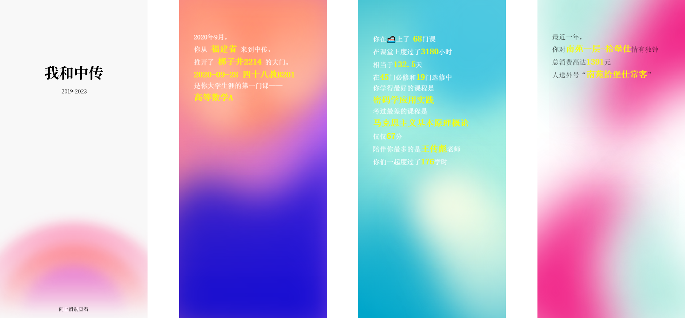

## 运行

```sh
npm i
npm start
# go to localhost:3000
```

## 截图





## demo

https://bj.bcebos.com/szbwg/tmp/xwu/index.html?key=12bb0c03-17c0-43cd-a675-bb8b7344c6c9

生成自己的可以访问 https://cuc.neixiangde.ren/2023grads/学号/密码 但是账号一定要关闭两步验证

在 https://sso.cuc.edu.cn/personalInfo/personCenter/index.html#/accountsecurity 

这里要解绑：


后面如果需要绑定可以ddd我一下 https://neixiangde.ren/contact-form


